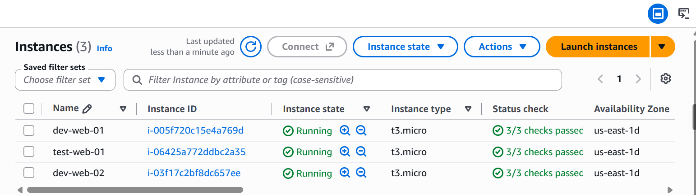
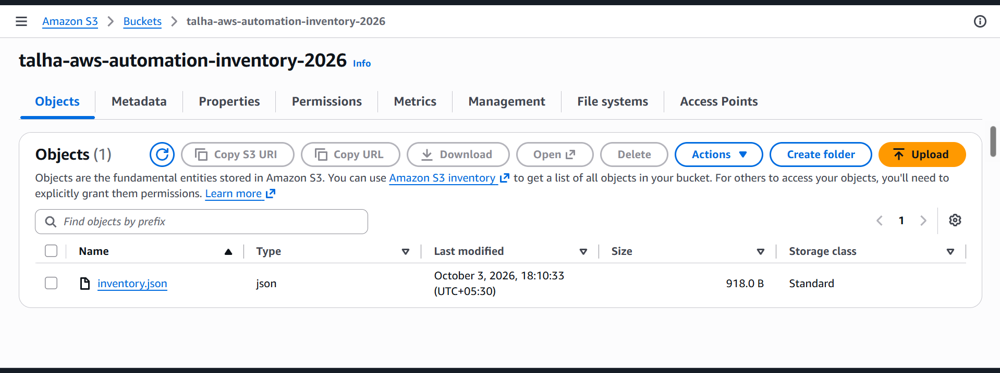

# AWS EC2 Inventory & Automation

A beginner-friendly AWS automation project built with Python and Boto3.

## What This Project Does

- Discovers EC2 instances using Boto3
- Collects instance details and tags
- Generates an `inventory.json` report
- Automatically starts a stopped EC2 instance when:
  - Environment = `Dev`
  - AutoStart = `True`
- Waits until the instance reaches the `running` state
- Uploads the inventory report to Amazon S3

## Technologies Used

- Python
- Boto3
- AWS EC2
- Amazon S3
- IAM
- JSON

## Project Structure

```text
aws-ec2-inventory-automation/
├── screenshots/
│   ├── aws-ec2_2.png
│   └── aws-s3_1.png
├── main.py
├── s3_upload.py
├── inventory.json
├── requirements.txt
└── .gitignore
```

## AWS Resources

### EC2

Three EC2 instances were used to test the inventory and automation functionality.

### S3

The generated `inventory.json` report is uploaded to an S3 bucket.

## Screenshots

### EC2 Instances



### S3 Bucket



## Project Goal

This project was built to practice Python-based AWS automation using Boto3 and understand how Python can be used to interact with and automate AWS infrastructure.